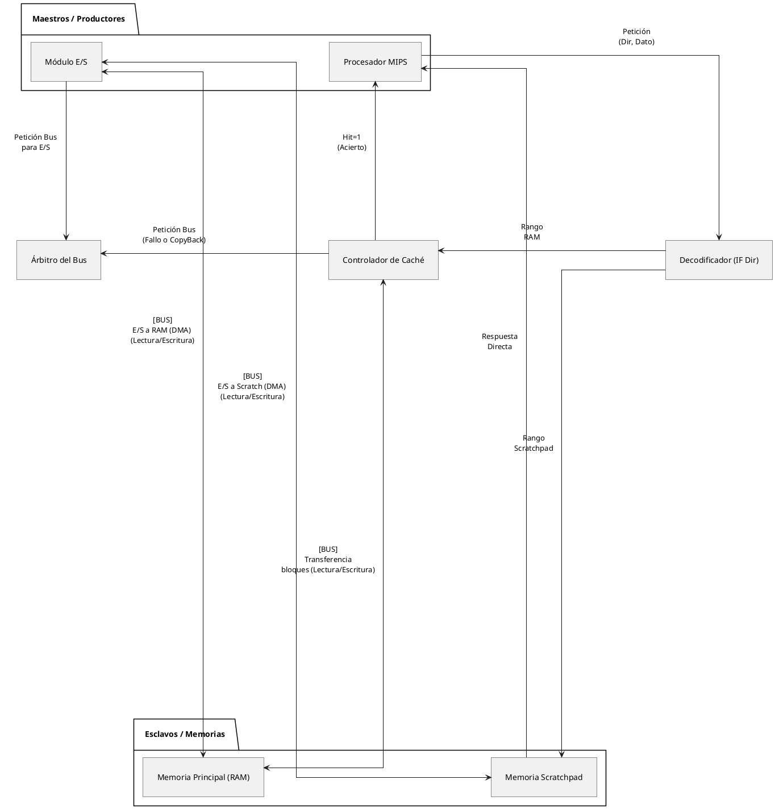

# Arquitectura de Computadores 2: Subsistema de Memoria (Proyecto 2)

## 1. Arquitectura General del Sistema-on-Chip (SoC)

El diseño del subsistema se rige por un esquema **Multi-Maestro (Multi-Master)** donde el procesador MIPS y el Módulo de Entrada/Salida (E/S) compiten por el control del Bus del Sistema recurriendo al Árbitro.

A continuación se presenta el diagrama de rutas de datos y peticiones del sistema:

## 2. Políticas de Configuración de la Memoria Caché

El diseño de la Memoria Caché de datos sigue las siguientes especificaciones asimétricas para su política de escritura:

- **Escritura en Aciertos (Write Hit): Copy-Back.** Los datos modificados se escriben únicamente en la Vía de la Caché elevando el *Dirty Bit* ('Sucio'). Esta política optimiza el tráfico, ya que no se accede al bus exterior innecesariamente hasta que el bloque sea forzosamente desalojado.
- **Escritura en Fallos (Write Miss): Write-Around (Write-No-Allocate).** Si la dirección de memoria no se encuentra en las vías, el controlador rechaza su ingesta. Confiere una petición de Bus directa a la RAM principal, y escribe la palabra sin alterar en ningún momento el contenido interno actual de la Caché.

## 3. Matriz Genérica de Casos de Uso

Teniendo en cuenta las rutas del datapath y las políticas del MIPS y MC, la memoria lidia de la siguiente manera con los 9 escenarios estándar:

| ID | Operación / Escenario | Maestro / Inicia | Componente Destino | Condición Hardware | ¿Usa Bus General? | Descripción del Flujo Físico Resultante |
| :---: | :--- | :---: | :---: | :--- | :---: | :--- |
| **1** | **MIPS Acceso a Scratchpad** | **MIPS** | MemScratch | Address en rango dedicado. | ❌ **No** | Petición directa decodificada por IF. La Scratchpad lee o guarda el dato en **1 ciclo**, ignorando al resto de componentes. |
| **2** | **Acierto LECTURA Caché** | **MIPS** | Caché | Instrucción `lw` / Hit = 1. | ❌ **No** | El controlador comprueba Tag + Validez, y responde al MIPS de forma instantánea (**1 ciclo**). |
| **3** | **Acierto ESCRITURA Caché** | **MIPS** | Caché | Instrucción `sw` / Hit = 1. | ❌ **No** | Se sobreescribe la palabra en la vía de la caché y se levanta su **Bit de Sucio = 1**. |
| **4** | **Fallo de LECTURA Caché** | **Caché** | RAM principal | Instrucción `lw` / Hit = 0. | ✅ **SÍ** | Controlador detiene pipeline MIPS, luego pide el Bus. Tras esperar la latencia, transfiere el Bloque entero de RAM a la Vía vacía y finalmente presenta el dato al MIPS. |
| **5** | **Fallo ESCRITURA Caché**| **Caché** | RAM principal | Instrucción `sw` / Hit = 0. | ✅ **SÍ** | *(Write-Around)*: No se carga nada. Pide el Bus y escribe directamente en la palabra destino dentro de la RAM Principal. |
| **6** | **Desalojo de Bloque** | **Caché** | RAM principal | Nuevo Fallo que precisa usar una taquilla con **DirtyBit=1**. | ✅ **SÍ** | Acción de *Copy-Back*: Pide el Bus, vuelca todo el bloque sucio desde la Vía hacia la Memoria Principal para evitar corrosión de datos, y reanuda la petición pendiente. |
| **7** | **DMA E/S a M. Principal** | **Mód. E/S** | RAM principal | Actividad de Entrada/Salida externa. | ✅ **SÍ** | El Árbitro cede la titularidad del Bus a los periféricos. El módulo E/S interfiere y transmite ráfagas de datos a la Memoria. |
| **8** | **DMA E/S a MemScratch** | **Mód. E/S** | MemScratch | Datos externos críticos (GPU/Red). | ✅ **SÍ** | El Árbitro cede el Bus. El tráfico DMA viaja desde los periféricos hacia la Scratchpad de bajo nivel (Permitiendo al MIPS seguir computando variables residentes en L1). |
| **9** | **Colisión de Maestros** | **Caché / E/S**| Árbitro Hardware | Petición sincrónica simultánea. | ✅ **SÍ** | El Árbitro detecta doble señal `Req`. Aplica la política Round-Robin o de Prioridad Fija definida en el circuito y concede el `Grant` al ganador, forzando esperas en el contrincante. |
