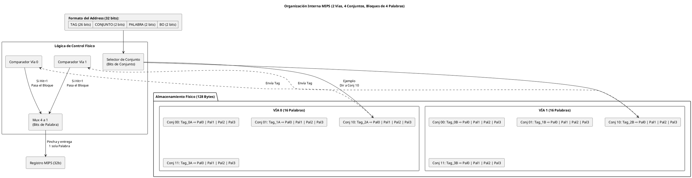

# Diagrama Estructural: Organización Interna de la Caché

Este fichero modela de manera exacta cómo la circuitería física de tu memoria lee la dirección suministrada por el MIPS, cómo baja directamente al "piso" correspondiente (Conjunto), cómo los comparadores verifican los Tags, y cómo el Multiplexor saca la palabra seleccionada del "cajón".

