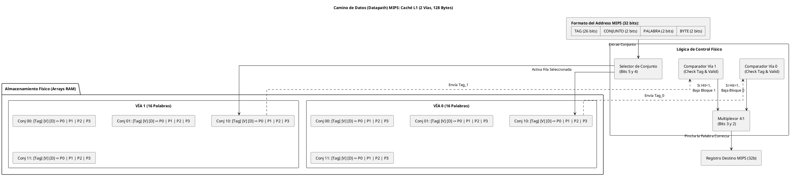

# Esquema Interno de la Memoria Caché de Datos

A continuación se detalla el diagrama lógico exacto del flujo de datos dentro de la caché, junto a la explicación del rol de la Unidad de Control (UC) en el manejo de fallos (Miss).

## 1. Diagrama de Enrutamiento Físico

## 2. Gestión de Fallos (Rol de la Unidad de Control)

Esta es la secuencia exacta que debe programarse en la Máquina de Estados (FSM) de vuestra **Unidad de Control (UC)** cuando los comparadores anteriores detectan un **Fallo (Miss)**:

1. **Salta la alarma (Freeze del MIPS):** El comparador chilla que hay un Miss. La UC agarra la interfaz del MIPS, y le mete la señal `Mem_Ready = 0` para congelarlo por completo y evitar que avance a la siguiente instrucción del pipeline.
2. **Pedir Permiso:** La UC levanta la mano al Árbitro (`Bus_req = 1`) y solicita la titularidad del Bus Semi-síncrono.
3. **¿A quién echamos? (El Reemplazo):** La UC lee la política FIFO para elegir qué vía víctima (la 0 o la 1) vamos a machacar. 
   👉 *Si encima es un bloque Sucio (Copy-Back)*, la UC tiene que pasarse varios ciclos tirando y volcando las 4 palabras a la Memoria Principal lentamente por el bus antes de pedir las nuevas, para salvar los datos al disco.
4. **Tráeme los datos (El Burst):** La UC le da la dirección de Address original a la RAM por el bus. Como los cables del gran bus principal miden también 32 bits, es físicamente imposible traerse el bloque de 128 bytes de golpe. Aquí la RAM inyecta una Ráfaga (**Burst**). Manda la Palabra 0 (1 ciclo de reloj), Palabra 1 (ciclo), Palabra 2...
5. **Guardar y Volver a la Normalidad:** Según van llegando esas 4 palabras en fila india desde el bus de la RAM, la UC las va estampando (escribiendo) dentro de las Memorias RAM internas de la Vía, usando los dos bits `[5 y 4]` del Address original para saber en qué altura de la estantería atornillarlas. Tras rellenarlo entero: 
   - Pone el Tag nuevo.
   - Marca el bloque como limpio y válido.
   - Libera al MIPS (`Mem_Ready = 1`).
   - El procesador MIPS se lleva por fin la palabra que quería de su `lw`, y la vida sigue.
