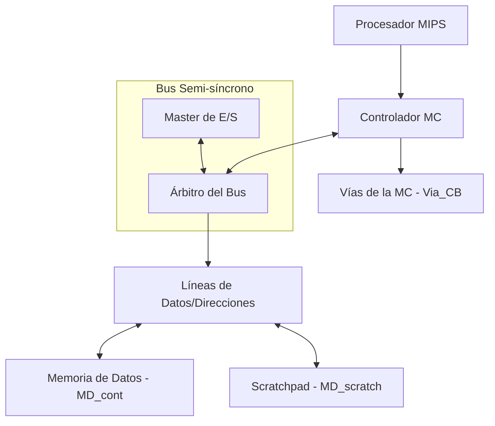

# Arquitectura del Sistema de Memoria MIPS (AOC2 - P2_26)

Este documento resume la estructura y el funcionamiento de los componentes revisados en el proyecto de diseño de una jerarquía de memoria con caché para un procesador MIPS.

## Visión General
El sistema implementa una jerarquía de memoria con una **Caché de Datos (MC)** de tipo *Copy-Back* (Write-Back) y un bus semi-síncrono que comunica el controlador de caché con la memoria principal (**MD**) y otros dispositivos de E/S.

### Diagrama de Conexiones (Subclase IO_MD)

---

## Análisis por Fichero

### 1. [IO_MD_subsystem_P2_26.vhd](file:///c:/Users/Pablo/Desktop/AOC2_p4/Moodle%202026_p2/Moodle%202026_p2/IO_MD_subsystem_P2_26.vhd)
Es el **Top-Level** del subsistema de memoria. Su función es instanciar y cablear:
- El controlador de la caché de datos.
- El árbitro del bus.
- La memoria principal y la memoria scratchpad.
- Los maestros de E/S.
- Gestiona las señales de `ready` y `abort` hacia el procesador MIPS.

### 2. [arbitro.vhd](file:///c:/Users/Pablo/Desktop/AOC2_p4/Moodle%202026_p2/Moodle%202026_p2/arbitro.vhd)
Implementa la lógica de gestión del bus.
- **Entradas:** `MC_Bus_Req`, `IO_M_Req` (solicitudes de acceso).
- **Salidas:** `MC_Bus_Grant`, `IO_M_bus_Grant` (permisos de acceso).
- Asegura que solo un dispositivo actúe como "Master" del bus en cada ciclo, evitando colisiones en las líneas de direcciones y datos.

### 3. [MC_datos_CB_2026.vhd](file:///c:/Users/Pablo/Desktop/AOC2_p4/Moodle%202026_p2/Moodle%202026_p2/MC_datos_CB_2026.vhd)
Es el cerebro de la caché de datos. Contiene la **Unidad de Control (UC)** que gestiona:
- **Aciertos (Hits):** Entrega el dato al procesador en el mismo ciclo (o el siguiente).
- **Fallos (Misses):** Solicita el bus, realiza la carga del bloque desde memoria y, si el bloque reemplazado estaba "sucio" (modificado), gestiona el volcado (*Copy-Back*) a memoria.
- **Señales de rendimiento:** Controla contadores como `inc_m` (fallos), `inc_w` (escrituras), etc.

### 4. [Via_2026_CB.vhd](file:///c:/Users/Pablo/Desktop/AOC2_p4/Moodle%202026_p2/Moodle%202026_p2/Via_2026_CB.vhd)
Representa una "vía" de la caché. Es el componente de hardware que almacena físicamente los datos.
- **Estructura:**
    - `memoria_cache_D`: RAM que guarda los datos (bloques).
    - `memoria_cache_tags`: RAM que guarda las etiquetas (Tags) para identificar los bloques.
    - `bits_validez`: Registro que indica si el bloque contiene datos válidos.
    - `bits_dirty`: Indica si el bloque ha sido modificado y debe guardarse en memoria al ser reemplazado.
- **Lógica de Hit:** Compara el `Tag` de la dirección solicitada con el almacenado y verifica que el bit de validez sea '1'.

### 5. [MD_cont_2026.vhd](file:///c:/Users/Pablo/Desktop/AOC2_p4/Moodle%202026_p2/Moodle%202026_p2/MD_cont_2026.vhd) y [MD_scratch_2026.vhd](file:///c:/Users/Pablo/Desktop/AOC2_p4/Moodle%202026_p2/Moodle%202026_p2/MD_scratch_2026.vhd)
Son los controladores de las memorias físicas.
- La **MD** es la memoria principal, más lenta y que requiere gestión del bus.
- La **Scratchpad** es una memoria rápida mapeada en una zona específica de direcciones para datos críticos o de acceso frecuente.

### 6. [FIFO_reg.vhd](file:///c:/Users/Pablo/Desktop/AOC2_p4/Moodle%202026_p2/Moodle%202026_p2/FIFO_reg.vhd)
Un buffer tipo FIFO (First-In, First-Out) utilizado probablemente para desacoplar la velocidad del procesador/caché de la velocidad del bus, o para almacenar temporalmente ráfagas de datos durante las transferencias de bloques.

---

## Flujos de Trabajo Clave

### Lectura con Fallo (Read Miss)
1. El MIPS pide un dato. La `MC` detecta `hit = '0'`.
2. El controlador de `MC` activa `MC_Bus_Req`.
3. El `Arbiter` concede el bus con `MC_Bus_Grant`.
4. La `MC` envía la dirección al bus y espera a que la `MD` responda (`MD_Bus_TRDY`).
5. Se cargan las 4 palabras del bloque en la `Via_CB`.
6. Se actualiza el `Tag` y el bit de validez.

### Escritura (Copy-Back)
1. Si se escribe en un bloque en caché, se marca como **Dirty**.
2. No se escribe inmediatamente en memoria (ahorra tráfico de bus).
3. Si ese bloque debe ser reemplazado por otro nuevo, la caché detecta `dirty = '1'` y primero escribe el bloque viejo en la `MD` antes de cargar el nuevo.

---

## Mejoras Técnicas y Decisiones de Diseño (Revisión Intermedia)

Durante el desarrollo se han implementado varias correcciones y optimizaciones críticas para asegurar la estabilidad y precisión del sistema.

### 1. Optimización del Acceso a Scratchpad (UC)
Se identificó una inconsistencia en el acceso a la memoria Scratchpad a través del bus. Originalmente, la Unidad de Control (UC) esperaba la señal `Bus_DevSel` de forma genérica para todos los esclavos. Sin embargo, debido a que el Scratchpad es un recurso interno mapeado en el bus con tiempos de respuesta muy rápidos, esperar a que la señal se propagara a través de la lógica de "OR" del bus introducía retardos innecesarios.

**Cambio realizado:** En el estado `single_word_transfer_addr`, se permite la transición al estado de datos si la dirección es no-cacheable (`addr_non_cacheable = '1'`), incluso si `Bus_DevSel` no se ha activado aún en ese ciclo exacto. Esto garantiza que el flujo de datos no se detenga y se mantenga la coherencia temporal con el Scratchpad.

### 2. Precisión en las Estadísticas de Rendimiento (Hit/Miss)
Se ha refinado la lógica de conteo de eventos para evitar sobreestimaciones. 
- **Problema detectado:** Al producirse un fallo (Miss), el procesador se detiene. Una vez que el bloque se carga en la caché, el procesador retoma la ejecución repitiendo la instrucción. Al repetirla, la caché detecta ahora un "Acierto" (Hit). 
- **Interpretación de datos:** Si simplemente sumamos los hits detectados por el hardware, estaríamos contando dos veces la misma operación (el intento fallido que luego es exitoso).
- **Fórmula de cálculo:** Para obtener los **Hits Verdaderos**, se debe aplicar la lógica:
  $$\text{Hits Reales} = \text{Contador Hits Hardware} - \text{Contador Misses Hardware}$$
  Esto asegura que solo se cuenten como aciertos aquellas solicitudes que NO requirieron un acceso previo a memoria principal en esa misma instrucción.

### 3. Robustez de la FSM ante Errores de Bus
Se ha mejorado la gestión de errores (como accesos a direcciones inexistentes o desalineadas).
- Se aseguró que la señal `ready` se active incluso en estados de error (`memory_error`). Esto es vital para "liberar" al procesador MIPS del estado de espera (stall) y permitir que gestione la excepción o continúe, evitando que el SoC se bloquee indefinidamente esperando una respuesta de un bus que ha fallado.

---

> [!TIP]
> **Pautas para la Revisión:**
> - Mostrar la ejecución de los bancos de pruebas en orden (desde `Test 1 Scratchpad` hasta `Test 8 Arbitraje`).
> - Destacar en las ondas de GTKWave cómo el bit `ready` se activa inmediatamente después de cargar el bloque tras un fallo.
> - Comentar el ajuste de las estadísticas de hit al presentar el resumen de rendimiento.
